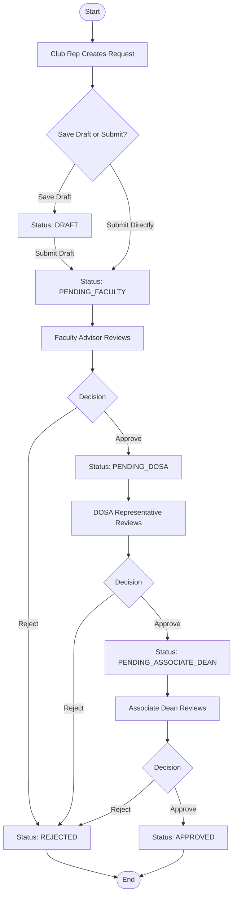

# Activity Diagram — Permission Request Lifecycle

```mermaid
flowchart TD
    START(["Start"]) --> CREATE["Club Rep Creates Request"]
    CREATE --> CHOICE{"Save Draft or Submit?"}
    CHOICE -->|"Save Draft"| DRAFT["Status: DRAFT"]
    DRAFT -->|"Submit Draft"| PFAC["Status: PENDING_FACULTY"]
    CHOICE -->|"Submit Directly"| PFAC

    PFAC --> FAC_REV["Faculty Advisor Reviews"]
    FAC_REV --> FAC_DEC{"Decision"}
    FAC_DEC -->|"Reject"| REJ["Status: REJECTED"]
    FAC_DEC -->|"Approve"| PDOSA["Status: PENDING_DOSA"]

    PDOSA --> DOSA_REV["DOSA Representative Reviews"]
    DOSA_REV --> DOSA_DEC{"Decision"}
    DOSA_DEC -->|"Reject"| REJ
    DOSA_DEC -->|"Approve"| PDEAN["Status: PENDING_ASSOCIATE_DEAN"]

    PDEAN --> DEAN_REV["Associate Dean Reviews"]
    DEAN_REV --> DEAN_DEC{"Decision"}
    DEAN_DEC -->|"Reject"| REJ
    DEAN_DEC -->|"Approve"| APP["Status: APPROVED"]

    APP --> END(["End"])
    REJ --> END
```
