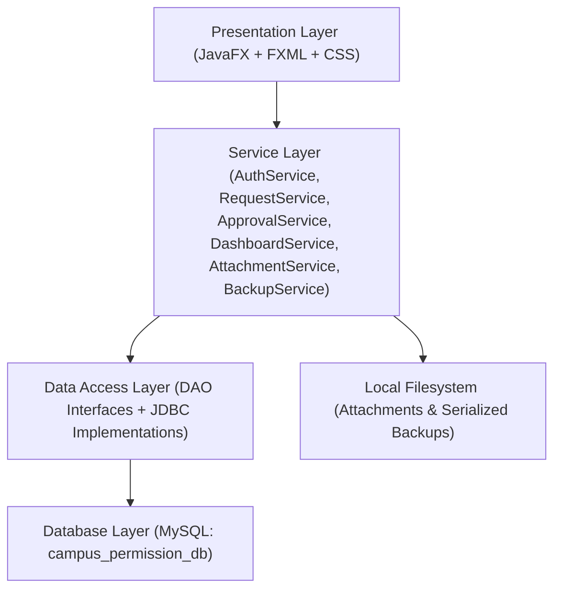

# Architecture Diagram

```mermaid
flowchart TD
    UI["Presentation Layer (JavaFX + FXML + CSS)"]
    SVC["Service Layer (AuthService, RequestService, ApprovalService, DashboardService, AttachmentService, BackupService)"]
    DAO["Data Access Layer (DAO Interfaces + JDBC Implementations)"]
    DB["Database Layer (MySQL: campus_permission_db)"]
    FS["Local Filesystem (Attachments & Serialized Backups)"]

    UI --> SVC
    SVC --> DAO
    DAO --> DB
    SVC --> FS
```
