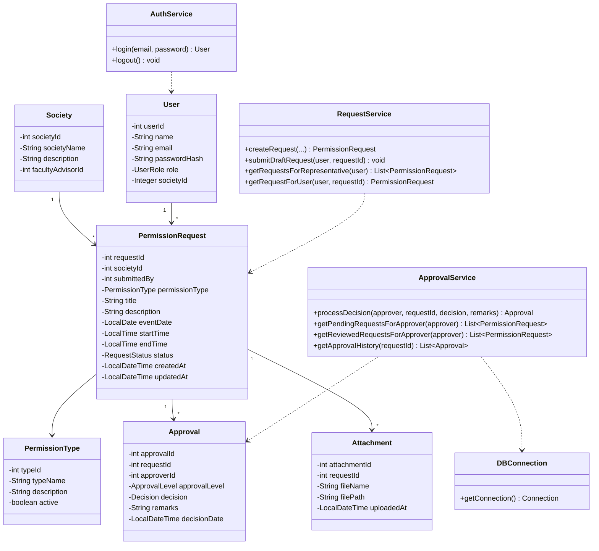

# Class Diagram

```mermaid
classDiagram
    class User {
        -int userId
        -String name
        -String email
        -String passwordHash
        -UserRole role
        -Integer societyId
    }

    class Society {
        -int societyId
        -String societyName
        -String description
        -int facultyAdvisorId
    }

    class PermissionType {
        -int typeId
        -String typeName
        -String description
        -boolean active
    }

    class PermissionRequest {
        -int requestId
        -int societyId
        -int submittedBy
        -PermissionType permissionType
        -String title
        -String description
        -LocalDate eventDate
        -LocalTime startTime
        -LocalTime endTime
        -RequestStatus status
        -LocalDateTime createdAt
        -LocalDateTime updatedAt
    }

    class Approval {
        -int approvalId
        -int requestId
        -int approverId
        -ApprovalLevel approvalLevel
        -Decision decision
        -String remarks
        -LocalDateTime decisionDate
    }

    class Attachment {
        -int attachmentId
        -int requestId
        -String fileName
        -String filePath
        -LocalDateTime uploadedAt
    }

    class AuthService {
        +login(email, password) User
        +logout() void
    }

    class RequestService {
        +createRequest(...) PermissionRequest
        +submitDraftRequest(user, requestId) void
        +getRequestsForRepresentative(user) List~PermissionRequest~
        +getRequestForUser(user, requestId) PermissionRequest
    }

    class ApprovalService {
        +processDecision(approver, requestId, decision, remarks) Approval
        +getPendingRequestsForApprover(approver) List~PermissionRequest~
        +getReviewedRequestsForApprover(approver) List~PermissionRequest~
        +getApprovalHistory(requestId) List~Approval~
    }

    class DBConnection {
        +getConnection() Connection
    }

    PermissionRequest --> PermissionType
    PermissionRequest "1" --> "*" Approval
    PermissionRequest "1" --> "*" Attachment
    Society "1" --> "*" PermissionRequest
    User "1" --> "*" PermissionRequest
    AuthService ..> User
    RequestService ..> PermissionRequest
    ApprovalService ..> Approval
    ApprovalService ..> DBConnection
```
