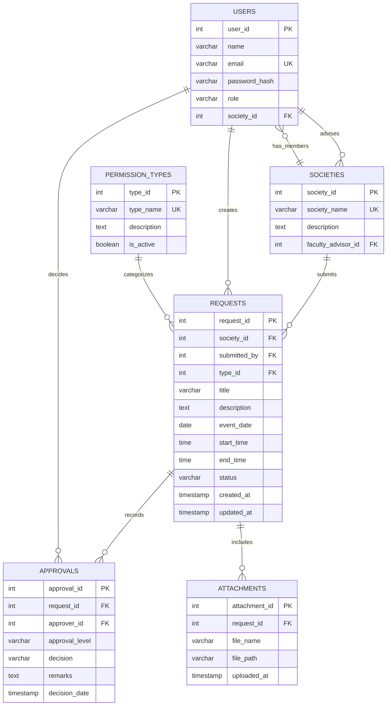

# Entity-Relationship (ER) Diagram

```mermaid
erDiagram
    USERS {
        int user_id PK
        varchar name
        varchar email UK
        varchar password_hash
        varchar role
        int society_id FK
    }

    SOCIETIES {
        int society_id PK
        varchar society_name UK
        text description
        int faculty_advisor_id FK
    }

    PERMISSION_TYPES {
        int type_id PK
        varchar type_name UK
        text description
        boolean is_active
    }

    REQUESTS {
        int request_id PK
        int society_id FK
        int submitted_by FK
        int type_id FK
        varchar title
        text description
        date event_date
        time start_time
        time end_time
        varchar status
        timestamp created_at
        timestamp updated_at
    }

    APPROVALS {
        int approval_id PK
        int request_id FK
        int approver_id FK
        varchar approval_level
        varchar decision
        text remarks
        timestamp decision_date
    }

    ATTACHMENTS {
        int attachment_id PK
        int request_id FK
        varchar file_name
        varchar file_path
        timestamp uploaded_at
    }

    USERS ||--o{ SOCIETIES : "advises"
    SOCIETIES ||--o{ USERS : "has_members"
    SOCIETIES ||--o{ REQUESTS : "submits"
    USERS ||--o{ REQUESTS : "creates"
    PERMISSION_TYPES ||--o{ REQUESTS : "categorizes"
    REQUESTS ||--o{ APPROVALS : "records"
    USERS ||--o{ APPROVALS : "decides"
    REQUESTS ||--o{ ATTACHMENTS : "includes"
```
