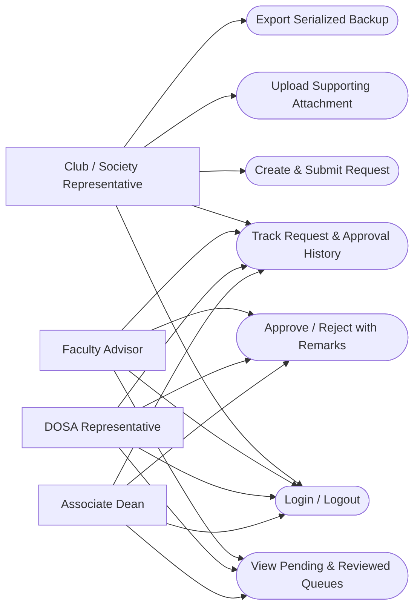

# Use Case Diagram

```mermaid
flowchart LR
    REP["Club / Society Representative"]
    FAC["Faculty Advisor"]
    DOSA["DOSA Representative"]
    DEAN["Associate Dean"]

    UC1(["Login / Logout"])
    UC2(["Create & Submit Request"])
    UC3(["Upload Supporting Attachment"])
    UC4(["Track Request & Approval History"])
    UC5(["Export Serialized Backup"])
    UC6(["View Pending & Reviewed Queues"])
    UC7(["Approve / Reject with Remarks"])

    REP --> UC1
    REP --> UC2
    REP --> UC3
    REP --> UC4
    REP --> UC5

    FAC --> UC1
    FAC --> UC6
    FAC --> UC7
    FAC --> UC4

    DOSA --> UC1
    DOSA --> UC6
    DOSA --> UC7
    DOSA --> UC4

    DEAN --> UC1
    DEAN --> UC6
    DEAN --> UC7
    DEAN --> UC4
```
